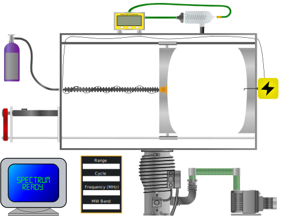
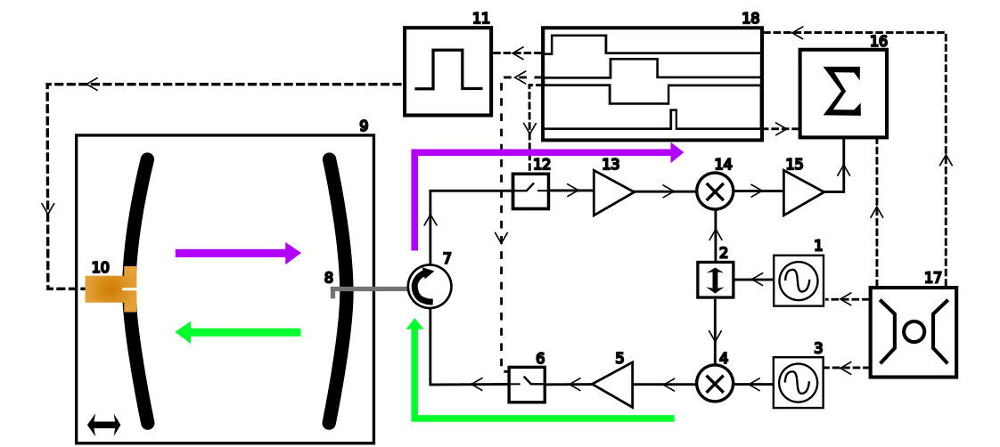
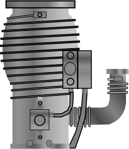
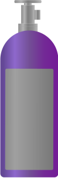

# FTMW (Fourier Transform MicroWave)

## [Instrument Window](instrument-window-component.svg)

## [Schematic Window](schematic-window-component.svg)

# Instrument Tip Images
## [Diffusion Pump](instrumentSVGs/diffusion-pump.svg)

## [Lecture Bottle](instrumentSVGs/gas.svg)

# Other Instrument SVGs

# Schematic Tip Images

# Other Schematic SVGs

